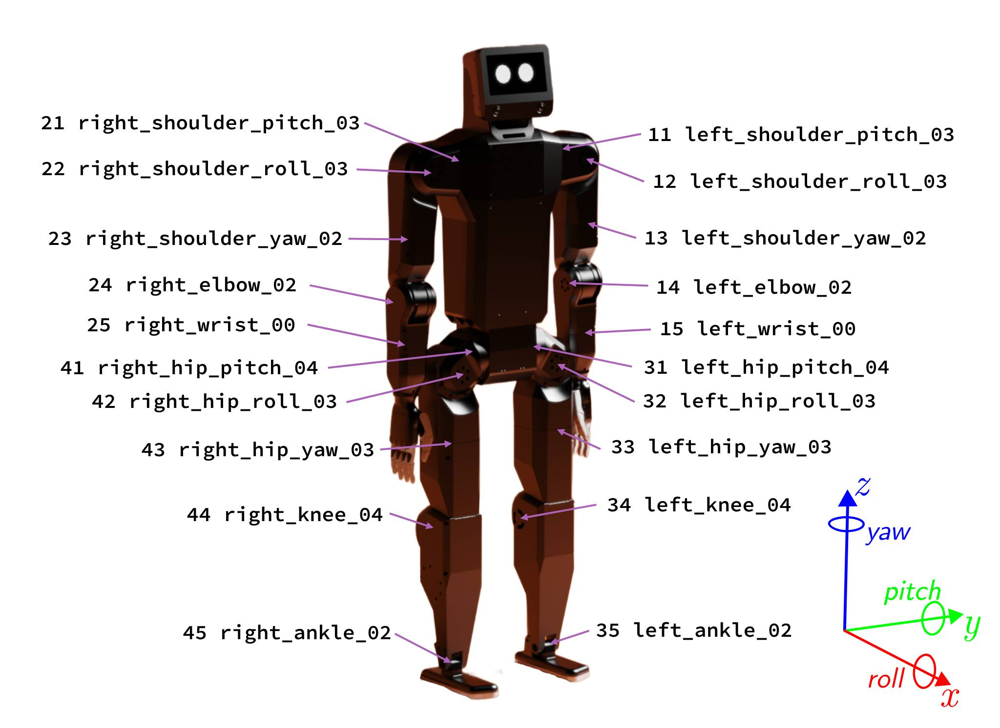

# Minimum Viable Product

*Basic locomotion, balance control, voice commands, and app-based control with predefined command set.*

## Hardware

### Body

- **K-Bot v2**

### Compute

- Jetson Orin NX

## Software

- K-Scale App
  - Joystick control: Move forward and backward, turn left and right, run simple emotes with arms
- Arm teleoperation: Command arms using K-Scale's teleoperation rig or through third-party interfaces like virtual reality headsets

## Machine Learning

- Mujoco-based `sim2real` pipeline
  - 2-3 million parameter models for low-level control running on-device
  - Parametrized by joystick control commands and target arm joint angles for building System 1 / System 2 style architecture
